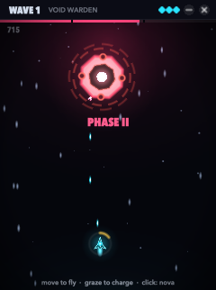
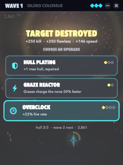

# Onslaught

A pocket boss-rush for the Mac. It floats in a small panel over your work: a neon arena, one boss at a time, and a
ship that goes wherever your pointer goes. Fight for the minute between two tasks. Move the pointer off the panel
and everything freezes on the spot.

 

## Play

- **Fly:** move the pointer over the arena. The ship chases it, fires on its own, and never needs a click or a key,
  so the app you are typing in keeps the keyboard.
- **Dodge:** only the white dot at the ship's centre can be hit. The glow around it can't.
- **Graze:** skim past bullets to charge the gold ring around the ship. **Click** when it is full to set off the
  **nova**: it wipes every bullet in a widening ring, cuts every beam, and hurts the boss.
- **Bosses:** each has three phases, broken at two thirds and one third of its hull. Every break clears the field
  and brings harder attacks. There are twelve kinds: rings, spirals, aimed fans, bursts, fountains, sweeping and
  sniping beams (a line warns first), mines you can shoot down before they burst, falling gates, curling flowers,
  rain, snakes, and a swinging machine gun. Every fifth wave is a **dreadnought**: bigger, tougher, with a barrage
  running under its attacks.
- **Runs:** hull carries from boss to boss, and each kill patches one point. After every kill, pick one of three
  upgrades (split barrels, overclock, tungsten rounds, seeker missiles, a wingman drone, hull plating, a deflector,
  a graze reactor, a nova core, afterburners). Lose your last hull point and the run is over.
- **Career:** your rank (Cadet to Immortal) counts bosses destroyed across all runs, so no break is wasted.

A fight lasts about 20 seconds at wave 1 and a minute by wave 15.

## Stays out of the way

| | |
|---|---|
| Pause | The moment the pointer leaves the panel. Coming back, the pointer must rest for a third of a second (a ring fills) before the fight resumes, so crossing the panel on the way to something else costs nothing. Click to skip the wait. SpriteKit stops drawing while paused, so a paused game uses no CPU. |
| Focus | Clicking the panel never activates Onslaught and never takes the keyboard. |
| Size | 200, 240 or 300 pt wide (menu ▸ Size), or the header's – button to fold it into a 176×28 pill with the wave, the boss's hull and yours. Click the pill to unfold it. |
| Presence | No Dock icon. Menu bar ◎ menu. **⌃⌥O** shows and hides the panel from anywhere. It floats on every Space and over full-screen apps, and dims to 60% while you are away. |
| Sound | None. |
| Save | Continuous (`~/Library/Application Support/Onslaught/save.json`): quit mid-fight and you resume on the same frame. |

## Build

```sh
make test    # the core: patterns, collisions, phases, upgrades, runs, saves (Linux too)
make sim     # the autopilot fights every wave and plays whole runs: win rate, fight length
make run     # builds build/Onslaught.app (macOS 14+) and opens it
```

- `OnslaughtCore` is the game: a fixed 120 Hz step, seeded, Foundation only. The same wave and seed always make the
  same boss, and a saved fight resumes exactly.
- `Onslaught` is the app: AppKit (the panel, the menu bar, a Carbon hot key) and SpriteKit (the arena). All art is
  drawn in code: glows, beams, particles, shockwaves, screen shake, hit-stop. There are no asset files.
- `onslaught-sim` flies the autopilot, which looks half a second ahead along every bullet. `--reaction 0.2` slows
  its decisions to something closer to a person. CI fails if the first waves stop being winnable or fights drift
  outside 12–90 seconds.

CI (`.github/workflows/onslaught.yml`) runs the tests and the balance check on Linux and macOS, bundles the app, and
launches it with `ONSLAUGHT_SELFTEST=1`. That self-test engages the way a returning pointer does, steers with pointer
moves, fights a boss, fires a nova with a click, picks an upgrade from the card, folds into the pill, checks that
leaving pauses (and that a passing pointer doesn't resume), starts a new run from the debrief, and checks the save.
It writes the screenshots above. CI then commits `dist/Onslaught.app.zip`, `dist/Onslaught.dmg` and the
screenshots.

The app is ad-hoc signed and not notarised. The first time you open it, right-click ▸ Open, or run
`xattr -dr com.apple.quarantine Onslaught.app`.
