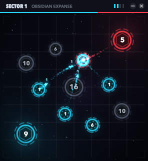
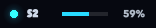

# Skirmish

A pocket-sized real-time conquest game for the Mac. It lives in the menu bar and in one small panel that floats over
your work. Play a battle in the minute between two tasks. Move the pointer away and the battle freezes where it is.

 

## Play

- **Attack:** press on one of your (cyan) outposts and drag to a target. Or click yours, then click the target.
  Sweep across more of your outposts on the way to send from all of them. Double-click or **A** selects everything
  you hold. Right-click or **Esc** clears the selection.
- **Force:** **1–4**, the scroll wheel, or the pips in the header set how much of each garrison goes (25–100%).
- **Combat:** every outpost you hold builds troops, and bigger outposts build faster. The unclaimed build nothing.
  A fleet that lands on a hostile outpost trades one for one with the garrison, and if more attackers are left, the
  outpost is yours. Citadels have walls, so each defender counts as 1.25.
- **Win:** wipe out every enemy faction. **Lose:** hold nothing and have nothing in flight.
- **Campaign:** each victory takes a sector and moves you to the next one. Every fifth sector is a siege of a walled
  citadel. From sector 4 on, some sectors have two or three enemy factions, and they fight each other as well as you.
  A defeat costs only your streak: the sector comes back on a fresh map. Ranks run from Recruit to Emperor.

## Stays out of the way

| | |
|---|---|
| Pause | Automatic when the pointer leaves the panel. SpriteKit stops drawing, so a paused game uses no CPU. |
| Focus | Clicking the panel never activates Skirmish, so the app you were working in stays frontmost. |
| Size | 236, 296 or 376 pt square (menu ▸ Size), or **C** / the header's – button to fold it into a 156×28 pill that shows your sector and your share of all troops. Click the pill to unfold it. |
| Presence | No Dock icon. Menu bar ⚔ menu. **⌃⌥G** shows and hides the panel from anywhere. It floats on every Space and over full-screen apps. It dims to 60% while you are away. |
| Sound | None. |
| Save | Continuous (`~/Library/Application Support/Skirmish/save.json`): quit mid-battle and you resume on the same frame. |

## Build

```sh
make test    # rules, maps, AI, save/restore (Linux too)
make sim     # every sector played bot-vs-bot: win rate, length
make run     # builds build/Skirmish.app (macOS 14+) and opens it
```

- `SkirmishCore` holds the rules, the seeded map generator, the enemy commander and the campaign. It uses only
  Foundation and is deterministic from a seed, so a saved battle replays exactly.
- `Skirmish` is the app: AppKit (panel, menu bar, Carbon hot key) and SpriteKit (the scene). All art is drawn in
  code: glows, particles, shockwaves, screen shake. There are no asset files.
- `skirmish-sim` is a headless balance check. CI runs it and fails if the first sectors stop being winnable.

CI (`.github/workflows/ci.yml`) runs the tests on Linux and macOS, bundles the app, and launches it with
`SKIRMISH_SELFTEST=1`. That self-test plays a real battle, checks the pill, pause and save, and writes the
screenshots above. CI then commits `dist/Skirmish.app.zip`, `dist/Skirmish.dmg` and the screenshots.

The app is ad-hoc signed and not notarised. The first time you open it, right-click ▸ Open, or run
`xattr -dr com.apple.quarantine Skirmish.app`.
