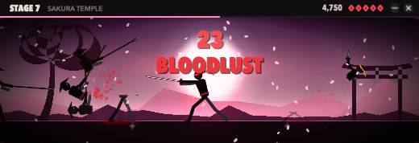
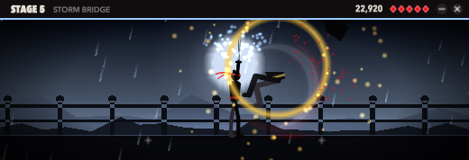
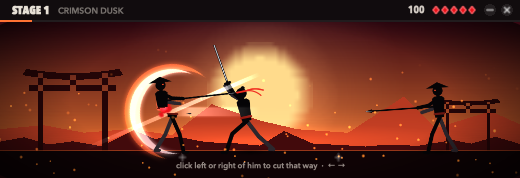

# Ronin

A pocket sword-fight for the Mac. One lone swordsman stands in the middle of a thin strip that floats over your
work. Enemies charge from both sides. Click the side you want to cut. A stage takes about half a minute, which
fits in the gap between two tasks. Move the pointer away and the fight freezes where it is.





## Play

- **Cut:** click left of the ronin to cut left, right of him to cut right. Once the panel has the keys you can
  also use **←/→**, **A/D** or **F/J**. A cut hits the nearest enemy (or incoming arrow) on that side if it is
  within reach. The ticks on the ground show the reach, and they light up when a cut would land.
- **Don't whiff:** a cut with nothing in reach makes him stumble. For a third of a second he can't cut, and your
  combo is gone.
- **Enemies:** *Ashigaru* spearmen (one cut). *Runners* (fast). *Brutes* (three cuts, each one knocks him back,
  and his blow costs two hearts). *Archers* stop out of reach and shoot: cut the arrow once it is in reach and it
  flies back into them. *Blade dancers* take two cuts, and the first one sends them flipping over your head to
  your other side. A red flush and a glint on an enemy mean his blow is coming.
- **Warlord:** every fifth stage ends with one. He takes many cuts, and after each one he is either knocked back
  or leaps over you. His blow costs two hearts.
- **Combo:** every kill and every deflected arrow adds one. The combo multiplies your score (×2 at 10, up to ×8).
  At **20** you go into **bloodlust**: the screen turns red and your reach gets longer. A wound or a whiff ends the combo.
- **Stages:** you have five hearts per stage. Clear the whole roster to move on. If you fall, you retry the same
  stage with a new roll. Each stage brings more enemies, faster ones, and new kinds, across eight settings: Crimson
  Dusk, Bamboo Grove, Blood Moon, Frozen Pass, Storm Bridge, Burning Village, Sakura Temple and Ash Fields.
- **Rank:** kills count toward your rank whether you win or lose. The ranks run from Wanderer through Swordsman,
  Ronin, Duelist, Blademaster, Kensei, Sword Saint and Demon Blade up to Legend.

## Stays out of the way

| | |
|---|---|
| Pause | Starts the moment the pointer leaves the panel. When the pointer comes back it has to rest for a third of a second (a ring fills) before the fight resumes, so crossing the panel on the way to something else costs nothing. Click to skip the wait. That click never cuts. SpriteKit stops drawing while paused, so a paused game uses no CPU. |
| Focus | Clicking the panel never activates Ronin. The app you were working in stays the active app. |
| Size | A strip 340, 420 or 520 pt wide and under 180 pt tall (menu ▸ Size). Press **C** or the header's – button to fold it into a 188×28 pill that shows the stage, your hearts and how many enemies are left. Click the pill to unfold it. |
| Presence | No Dock icon. It has a menu bar icon. **⌃⌥R** shows and hides the panel from anywhere. It floats on every Space and over full-screen apps. It dims to 60% while the pointer is elsewhere. |
| Sound | None. |
| Save | Continuous (`~/Library/Application Support/Ronin/save.json`). If you quit mid-fight, you resume on the same frame. |

## Build

```sh
make test    # the core: cuts, reach, whiffs, every enemy, arrows, stages, career, saves (Linux too)
make sim     # the autopilot plays every stage: win rate, fight length, wounds
make run     # builds build/Ronin.app (macOS 14+) and opens it
```

- `RoninCore` is the game. It runs a fixed 120 Hz step, is seeded, and uses Foundation only. The same stage and
  seed always make the same fight, and a saved fight resumes exactly.
- `Ronin` is the app. It uses AppKit (the panel, the menu bar, a Carbon hot key) and SpriteKit (the lane). All art
  is drawn in code, with no asset files: the silhouettes are posed from a small skeleton and drawn frame by frame
  into textures, and the effects include slash crescents, enemies cut in half, ink sprays, hit-stop, slow motion,
  screen shake and weather.
- `ronin-sim` plays stages with a human-like pilot (0.22 s reaction, 7 cuts a second, an occasional wrong-way cut)
  and with a perfect one. CI fails if the early stages stop being winnable, if the perfect pilot ever loses, or if
  fights last less than 15 or more than 150 seconds.

CI (`.github/workflows/ci.yml`) runs the tests and the balance check on Linux and macOS, bundles the app, and
launches it with `RONIN_SELFTEST=1`. The self-test does these things in order:

1. Makes the first cut and a whiff the way clicks do.
2. Lets the autopilot clear stage 1, then advances from the banner.
3. Fights a warlord.
4. Rides a combo into bloodlust.
5. Falls and rises again.
6. Folds into the pill and back.
7. Checks that leaving pauses and that coming back takes the dwell.
8. Checks the save.

It writes the screenshots above. CI then commits `dist/Ronin.app.zip`, `dist/Ronin.dmg` and the screenshots.

The app is ad-hoc signed and not notarised. The first time you open it, right-click ▸ Open, or run
`xattr -dr com.apple.quarantine Ronin.app`.
