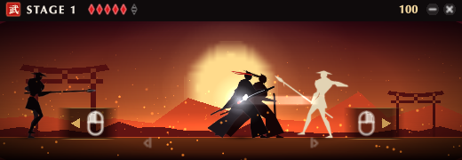
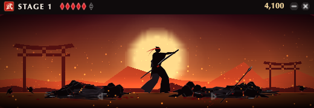
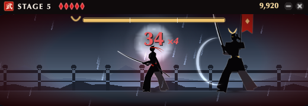

# Ronin

A pocket sword-fight for the Mac. One lone swordsman stands in the middle of a thin strip that floats over your
work. Enemies charge from both sides. The left mouse button cuts left and the right button cuts right. A stage
takes about half a minute, which fits in the gap between two tasks. Move the pointer away and the fight freezes
where it is.





## Play

- **Cut:** the **left mouse button** cuts left and the **right button** cuts right, wherever the pointer is on the
  lane. On a trackpad, a two-finger click or a control-click cuts right. Once the panel has the keys you can also
  use **←/→**, **A/D** or **F/J**; a click, **Space** or **Return** goes on past a stage's card, or resumes.
  Menu ▸ Controls lists them all. A cut hits the nearest enemy (or incoming arrow) on that side if it is within
  reach.
  - **Learning the buttons:** a new career's first stage card shows which button cuts which way. Until you have cut
    down an enemy on each side, a cut the wrong way while an enemy is in reach on the other side flashes the mouse
    for that side under the lane.
  - **Floor hints** (menu ▸ Floor Hints, off by default) add two aids on the ground: chevrons that mark the reach
    and light up when a cut would land, and a mouse under each half of the lane showing which button to press, until
    you have cut down an enemy on each side. Turning them on teaches the buttons again.
- **The ronin** fights in the manner of the classical sword schools, two hands on the hilt. Each stage opens with
  him in the iai stance, blade sheathed, and his first cut is a **nukitsuke**: the draw and the cut in one motion
  while his other hand pulls the scabbard back. After that he picks a cut to suit what is in front of him, and never
  the same one twice in a row, each from the stance it is taught from:
  - **morote-zuki** (a two-handed thrust) or a stamping **shōmen** from jōdan to close a long gap,
  - **shōmen** and **kesa-giri** (from hassō, diagonally down) for the big ones,
  - **sune-giri** (dropping to cut at the shins) and **gyaku-kesa** (rising from waki-gamae) for the quick ones,
  - **dō-giri** (level through the waist) and the diagonals to meet an arrow.

  His hands lead each cut and the blade whips through after them. When he closes a long gap he leaves afterimages
  behind. At the end of a stage he throws the blood from his blade (ō-chiburi), sinking into the snap on his guard's
  footing, and slides it home (nōtō) as he rises. If he falls, he goes down to one knee over his sword, pitches
  forward onto his hands and lies face down.
- **Don't whiff:** a cut with nothing in reach makes him stumble (a grey ✕ over his head). For about a third of a
  second (a quarter on Shoshin, nearly half on Oni) he can't cut, and your combo is gone. A second press made while
  a cut is still landing waits for it, and is let go if the man it was meant for is gone (knocked back, in the air,
  felled) or has his guard coming up.
- **Enemies** each strike from their own weapon's reach, so a blow drawn landing on you lands on you: *Ashigaru*
  spearmen thrust from the length of the spear, at the very edge of your reach (one cut). *Runners* (fast). *Brutes*
  (three cuts, each one knocks him back, and his blow costs two hearts). *Archers* stop out of reach and shoot: cut
  the arrow once it is in reach and it flies back into them. *Blade dancers* take two cuts (three from stage 12), and
  each cut that doesn't fell them sends them flipping over your head to your other side. Only the man at the front of
  a line strikes; the ones behind wait their turn. When an enemy raises his weapon he flushes red and a red marker
  appears over his head. The ring around the marker runs out as his blow comes. An archer drawing his bow shows a
  red sight line to you, and pips over a tough one count the cuts he has left.
- **Warlord:** every fifth stage ends with one, and each is tougher than the last (12 cuts at stage 5, four more
  every warlord after, up to 40). His bar sits in the header (or, when the header is crowded, runs as a thin line
  along its foot), and stage 5's card warns you: *wait out his guard*. He raises his guard as he closes in, and
  sometimes as he recovers: a faint ward grows before him, then flashes and rings as it sets.
  - A cut that meets it **still rising** clashes lightly on his blade and glances off with a few sparks, and you
    draw back into guard: no harm done on either side.
  - A cut into a **set** guard binds on his blade: the blades ring and cross in a spray of sparks and a flash of
    steel, the lane pushed in and frozen on it, then he shoves you off and you back off a step or two in guard (a gold
    ⊗ over you). It throws you off balance, ends your combo and draws his answer, a two-heart blow that catches you
    backing off if he was close. So wait for it to drop; brought in close behind it, he strikes the moment it does.

  Cut him and he is thrown back or somersaults over your head, and half the time he comes down cutting. At three
  quarters, a half and a quarter of his strength (ticks on his bar) he calls men in from both ends of the lane (from
  stage 10 a runner among them and a brute or blade dancer behind, two from stage 15). As he weakens he grows faster
  and angrier, red haze and all, and more often follows one blow straight with a second. His blow costs two hearts,
  and none but his answer to a turned cut comes quicker than 0.3 s.
- **The gourd:** once a stage, one spearman or runner comes in with a gourd of medicine over his head. He takes two
  cuts and keeps just out of reach, darts in to strike and backs off again, and after his second blow (or if he has
  been about too long) runs off the lane with it. Just before each dart he crouches over his weapon and the gourd
  flares, and his blow never comes so quick that a cut made on seeing him go can't meet it. Each cut has to catch him
  close, on a dart of his own: one that doesn't fell him sends him hopping back out of reach. Stage 1's card says
  it: *catch him darting in, twice*. Cut him down and a heart comes back (points if you are full). The pips for the
  cuts he has left sit either side of his gourd.
- **The dead** come apart along the line of the cut: halved on the slant or through the waist, heads taken (a warlord
  always loses his); cut across the shins, a man drops onto his knees and pitches onto his face; run through or shot,
  they are thrown back off their feet or fold where they stand. Each falls from the very pose his figure froze in at
  the blow, so nothing jumps, and his weapon leaves his hand as he held it. The top half is flung away tumbling, arms
  flying, trailing blood, while the legs stand a moment, pumping, before the knees go. Every body is a jointed
  ragdoll (knees and elbows bending only the way they bend) that goes slack and collapses under its own weight, each
  piece reaching for a pose of its own as it goes, so each comes down and lies its own way: face up or face down on
  its outline as drawn, its banner, quiver, hat and sleeves on the ground with it. The dead stay for the whole stage
  at ground level, through folding, resizing (scaled with the lane) and the menu, in a low carpet that the living
  walk through (past more than a full stage leaves, the oldest fade, weapons first). Blood pools under the bodies,
  flecks the ground, and when you are hit, runs down the glass. You wear the stage's blood until the chiburi throws
  it off.
- **Gore** builds with the stages: a light touch at stage 1 (now and then a cut only fells a man), full by stage 10,
  heavier on to stage 20 and on through an endless run. In **bloodlust** it is at its heaviest: more and bigger
  sprays, wounds pumping longer, more men cut apart (a thrust may tear one open), more blood on the glass, wider,
  darker pools. Menu ▸ Gore turns it off (it is on until you do): then nothing bleeds and nobody comes apart, every
  man falls whole, and a blow still lands with its freeze, shake, the cut's mark and sparks off the blade. It takes
  effect with whatever happens next; the blood already spilt stays.
- **Combo:** every kill and every deflected arrow adds one. The combo multiplies your score (×2 at 10, up to ×8).
  At **20** you go into **bloodlust**: the edges of the lane turn red and your reach gets longer. A wound, a whiff
  or a turned cut ends the combo (a glance does not), and each stage starts it afresh. On your last heart the edges
  darken with a heartbeat, and the last heart in the header beats.
- **Difficulty** (menu ▸ Difficulty): each mode keeps its own stage and the hearts it carries, both shown on its
  menu item.

  | Mode | Means | Hearts | Enemies | Your reach | Score |
  |---|---|---|---|---|---|
  | **Shoshin** (beginner's mind) | easy | 7 | slower, fewer, longer wind-ups | +8% | ×0.5 |
  | **Bushidō** (the way of the sword) | normal | 5 | as designed | — | ×1 |
  | **Shura** (the realm of carnage) | hard | 4 | faster, more, quicker blows | −3% | ×1.6 |
  | **Oni** (the demon) | insane | 3 | much faster, crowded, blows come fast | −8% | ×3 |

- **Stages:** your hearts carry from one stage to the next; the gourd is the only way to get one back. Clear the
  whole roster to move on. If you fall, the campaign starts again from **stage 1** with full hearts. Each stage
  brings more enemies, faster ones, and new kinds, across eight settings: Crimson Dusk, Bamboo Grove, Blood Moon,
  Frozen Pass, Storm Bridge, Burning Village, Sakura Temple and Ash Fields. By stage 25 everything is at full
  strength; past it the enemies keep quickening up to stage 50, and the warlords keep hardening.
- **Walking away:** menu ▸ Restart Stage (it shows your hearts) is a fresh roll of the same stage at the hearts you
  have left, with its kills counted, so it is never better than playing on. Switching difficulty, or going into or
  out of an endless run, leaves a fight the same way. Past a stage's card the item reads Next Stage, or Start Over
  and the stage you start from.
- **Endless** (menu ▸ Endless): start a run from any stage you have reached. Stages follow one another without a
  card to click through, hearts carried, until you fall; a stage won while the pointer is away goes on to the next,
  which waits under the pause curtain. The fall card shows the run: stages cleared (∞), kills, best combo and score,
  and ↻ starts a new run from the same stage. Each starting stage keeps its best run (shown on its menu item), a run
  you leave through the menu included, and the campaign keeps its best too. A better run cleared more stages, or as
  many for more points; a tie is no record.
- **Rank:** every foe you cut down counts toward your rank, won, lost or walked away from; a kill on Shura counts a
  quarter more and one on Oni half as much again. The ranks run from Wanderer through Swordsman, Ronin, Duelist,
  Blademaster, Kensei, Sword Saint and Demon Blade up to Legend (25,000), which takes many hours. The menu shows your
  rank and how many kills the next one needs.

## Stays out of the way

| | |
|---|---|
| Pause | Starts the moment the pointer leaves the panel, or while you drag it by its header. When the pointer comes back it has to rest for a third of a second (a ring fills) before the fight resumes, so crossing the panel on the way to something else costs nothing. Click to skip the wait. That click never cuts. SpriteKit stops drawing while paused, so a paused game uses no CPU. Menu ▸ Pause When Pointer Leaves turns it off: the fight then runs on with the pointer away, until a stage's card comes up. |
| Focus | Clicking the panel never activates Ronin. The app you were working in stays the active app. A click on the lane takes the keys (so the arrows cut) until the pointer leaves (while leaving pauses), then they go back to your app. Keys with ⌘, ⌃ or ⌥, and ones the game does not use, are left alone. |
| Size | A strip 340, 420 or 520 pt wide and at most 180 pt tall (menu ▸ Size; Medium until you choose). It stays wholly on screen, and grows or shrinks toward the screen's middle, so a panel in a corner keeps to its corner. Press **C** or the header's – button to fold it into a 196×28 pill that shows the mode, the stage, your hearts and the run's score (123K, 1.2M once it is long). Click the pill to unfold it. |
| At a glance | The panel is small, so it uses pictures more than words. The header shows the mode as a vermilion seal (初 Shoshin, 武 Bushidō, 修 Shura, 鬼 Oni), the stage (with ∞ in an endless run), your hearts, a warlord's bar and the run's score (every stage of it so far). A won stage's card shows a skull for kills, crossed swords for your best combo, a clock for time and the score, and ▶ to go on. After a fall it shows the run instead: steps for the stages it cleared (∞ in endless), kills, best combo and score, and ↻ with the stage you start again from. ▲ marks a rank earned, or a run that beat its record (BEST RUN). The pause screen is a pause sign. What text there is is set in Optima capitals with wide letter-spacing, on dark bands edged with fine gold rules. |
| Presence | No Dock icon. It has a menu bar icon. **⌃⌥R** shows and hides the panel from anywhere, on the screen you are working on. Menu ▸ Shortcut offers ⌃⌥⌘R and ⌃⇧R instead, and if another app holds the one chosen, the next free one is used. **Esc** or **⌘W** hides it too. It floats on every Space and over full-screen apps. It dims to 60% while the pointer is elsewhere (menu ▸ Dim When Pointer Leaves). |
| Motion | Menu ▸ Reduce Motion (following the system setting until you choose): far less shake, no zoom punches, soft and slow full-lane flashes, lightning as a slow glow, a steady bloodlust edge and heartbeat, small faint impact lines, a shorter freeze and fainter flashes when blades clash, slams that drop in from nearer, and no thump through the lane from the heavy ones' steps. The blood and the dead are as they always are (that is menu ▸ Gore). |
| Gore | Menu ▸ Gore, on until you turn it off. It builds with the stages and is heaviest in bloodlust; off, there is no blood at all and nobody comes apart (see *Gore* above). It takes effect at once. |
| Sound | None. |
| Save | Continuous (`~/Library/Application Support/Ronin/save.json`). If you quit mid-fight, you resume on the same frame. An update may roll the stage in progress afresh (at the hearts you carried into it), but the career always carries over. A save that cannot be read is set aside as `save.unreadable-<date>.json`, never written over. Menu ▸ Reset Career… starts again from nothing. |

## Build

```sh
make test    # the core and the art: cuts, reach, every enemy, stages, careers, saves; every frame, the dead falling
make check   # the balance bars CI holds the game to (every ronin-sim --check it runs)
make sim     # the autopilot plays stages 1-20: win rate, fight length, wounds (--campaign: how far runs get)
make sheet   # SVG contact sheets in build/: every figure's every frame, how a cut leaves them, the dead falling
make run     # builds build/Ronin.app (macOS 14+) and opens it
```

All but `make run` work on Linux too.

- `RoninCore` is the game. It runs a fixed 120 Hz step, is seeded, and uses Foundation only. The same stage and
  seed always make the same fight, and a saved fight resumes exactly.
- `RoninArt` holds the figures, and uses Foundation only. Each frame is posed from a small skeleton and drawn as a
  list of shapes. The app renders those shapes with Core Graphics, and `ronin-sheet` renders the same shapes as
  SVG, so the art can be looked at and tested anywhere (`ronin-sheet out.svg ragdoll` shows the dead falling). Its
  `Ragdoll` is a small position-based solver: the skeleton of the pose a foe froze in at the blow, let fall under its
  own weight (each joint pulling on the bones either side of it, the light ones moved more), and turned back into a
  pose to draw each time it moves (a severed half drawn with the raw face of the cut, a head struck off with its
  gear).
  - **Style:** the figures are cut rather than rounded, with a fighting man's build about eight and a half heads tall:
    - broad in the shoulders, chest, back and thighs, fine at the waist, knees, ankles and wrists, the muscle of each
      limb swelling between its joints (a V from the shoulders to the waist; a calf behind the shin),
    - a head in proportion on a strong neck,
    - the ronin dressed loose: a kimono bloused over the sash, great hanging sleeves, a full hakama that billows at
      the knee and sweeps out at the hem, and his coat as two long tails that stream out behind him when he moves,
    - slender curved blades with a bright edge,
    - cloth that ends in points,
    - a thin rim of light so the black shapes read against dark ground.
  - **Enemies:** each kind has its own outline so you can tell them apart at 60 pt: a conical hat and spear, a
    shinobi hood, oni horns and a club, a scarf and twin blades, a bow taller than the archer, a crested helmet
    with a war banner.
  - **Grips:** hands are placed where a weapon is held and the arms reach them with a two-bone solve, so a katana,
    a nodachi, a yari and a kanabō are each held in both hands, the right at the guard and the left behind it.
  - **Enemy maneuvers:** the ashigaru draws his spear back to the hip and drives it out on a long step; the shinobi
    runs bent low with both arms swept back, then springs and slashes; the oni lifts the kanabō behind his head and
    brings it down into the ground; the blade dancer crosses both blades high and scissors them down; the archer
    shoots after kyūdō (bow raised over the head, drawn open as it comes down, held at full draw, released with the
    string hand flung back); the warlord carries his nodachi shouldered (katsugi), hauls it back over the shoulder
    for a huge stamping cut, and holds it angled up across him to guard. Walks have twelve frames and a gait of their
    own: the ashigaru's drilled march, the shinobi's low sprint with a moment off the ground, the oni's rolling stomp,
    the dancer's glide, the archer's bent-kneed stalk, the warlord's slow, upright step. Each leg swings on its own
    phase, the knee folding as it comes through and giving under the weight, and a walking foe advances a frame for
    each twelfth of its stride so its feet keep to the ground, backing off with the stride played backward. In the
    app they are drawn where the fight has them as they walk (a knock-back glides), lean into their stride, lurch into
    their blows and squash as they land; each change of pose blends out of the last behind a dark ghost of it, and
    they fade in quickly as they arrive. The oni and the warlord are felt as they come: each foot they set down
    raises a puff of dust and sends a small thump through the lane, and they sink into it. The gourd-bearer walks in
    to his spot and backs off to it with the same stride, crouches over his weapon as he readies himself, darts in at
    a run, low and leaning hard into it, and hops back from a cut rocked on his heels.
  - **The ronin** is drawn at a higher resolution and has the most frames: a breathing chūdan guard and the iai
    stance, and seven cuts (nukitsuke, kesa-giri, gyaku-kesa, shōmen, dō-giri, morote-zuki, sune-giri) of nine
    frames each: chambered in the cut's kamae, the swing with the wrists still cocked, the blade whipping through,
    full extension on a stamping lunge, the follow-through, and zanshin. Five more swing a cut again from the lunge
    of the last, and six step him back into guard. Two more cross blades with the warlord's (the bind, and forced off
    it), and four back him off in guard a foot at a time. His feet keep to the ground: he moves along the lane only in
    the blur of a lunge or a blow, or as a lifted foot is carried and set down.
    - **Footwork:** from a long lunge he pushes off and lifts the front foot back first, from a short one he draws the
      back foot up first; a cut swung again on the same side while he is still planted in the last one's lunge keeps
      its footing. Out of place after a blow, he steps back into guard a foot at a time, each foot moving only the way
      he is going; well off it (driven back into a clash, or backing off from one), he first steps toward it in guard.
    - **The clash:** a cut into the warlord's guard carries on into a bind on his blade, the ronin lunging out to where
      the blades meet or, the warlord standing closer, driven back into it; the warlord takes it braced on the same
      beat. Parried, the ronin is forced off it (the warlord shoving it off), the blade driven up and his coat and hair
      streaming, and backs off in guard a step or two; glancing off a guard still rising, he only draws back out of
      the bind.
    - **Struck,** he wheels to face whoever dealt the blow, so it drives him away from them, and reels one of three
      ways: rocked back and bracing, staggered back a step at a time, or dropped to a knee and pushed back up (more
      often the last, and slower, the worse he is hurt). Before the draw he is rocked back where he stands, his hand
      on the hilt.
    - **The struggle:** for a while after a blow, a miss or a turned cut, or whenever he is down to his last hearts,
      his guard is winded: heaving, a hand pressed to the bleeding wound (only if he has one), or the knees giving and
      caught again, each begun on a fresh breath and a new one chosen as each runs out.
    - **The fall:** struck, the knees going, down on one knee over his sword, pitching forward off it onto his hands,
      and face down (the blade still in its scabbard if he never drew it).
  - **Smear frames:** every fast frame (the ronin's swings, the draw, the chiburi, a stumble or a turned cut, every
    enemy's blow and leap) is drawn as a smear: the arms and weapon repeated back along the motion as fading
    multiples, a solid sweep of ink between the blades split into dry-brush strands, the body dragging echoes behind
    it, and the bright edge of the swing over the top. In the app a blow lands when the drawn blade gets there: until
    then the struck foe is held as he stands (a cut that doesn't fell him knocks him back or sends him leaping only
    then); a killing blow freezes him white, turned to the ronin, in the pose it throws him into, and he comes apart
    from exactly that pose as the frame freezes on the impact. A level cut is seen side-on, the blade shortening as
    it comes round and its trail a flat ellipse; a thrust leaves speed lines. In the app he darts out along the lane
    into each cut and back, stretched into it.
  - **Textures** are cut down to what each frame draws, keeping its place on the canvas, so the feet stay put.
- `Ronin` is the app. It uses AppKit (the panel, the menu bar, a Carbon hot key) and SpriteKit (the lane). The effects
  include slash crescents laid along each cut, blades binding in a ring of sparks and a flash of steel, enemies cut in
  half, ink sprays, hit-stop, slow motion, screen shake, focus lines snapping in around a big foe's death (the warlord's
  drawn for the blow, crisp, running in from past every edge of the panel), and weather in two layers: in front of the
  fight, and further off, finer and fainter, behind the ground, where what falls sinks out of sight and embers rise from
  beyond the horizon. Nothing blinks out in mid-air, and the wind never leaves one side of the lane bare. The figures,
  living and dead, stand in each setting's light: drawn a little toward its darkest tone, flashed in its own light when
  struck, and leaving dark, see-through ghosts (the pose just left, the ronin's afterimages) rather than pale grey ones.
- `ronin-sim` plays stages headless with a human-like pilot (0.22 s reaction, 7 cuts a second, an occasional
  wrong-way cut; `--reaction`, `--rate` and `--slips` change them, and `--rash` makes it lose patience with a
  warlord's set guard now and then) or a perfect one (`--perfect`), in one mode or every mode (`--mode all`), over
  `--stages` and `--seeds`. The table shows each stage's win rate, fight length, wounds, whiffs, parried cuts and the
  hearts a warlord took. `--campaign` plays runs from stage 1, hearts carried, until the ronin falls: how far they
  get, and what the gourd did (hearts given back, catches at full hearts, bearers that got away). `--trace <stage>`
  tells one fight second by second. With `--check` it exits 1 when the game misses a bar (`ronin-sim --help` prints
  them), and bad arguments exit 2. The bars:
  - the human-like pilot's early stages stay winnable (Shoshin 90% through stage 10 and 60% through 14; Bushidō 90%
    through 3 and 50% through 8; Shura 75% through 3 and 40% through 6; Oni 40% through 2),
  - it is parried at most 0.5 times a fight on any stage (unless `--rash`); more would mean guards turning cuts that
    were on their way before the guard could be seen,
  - the perfect pilot never loses, and its fights average 15 to 150 seconds a stage,
  - a campaign run (32 seeds) reaches on average at least stage 15 on Shoshin, 11 on Bushidō, 7 on Shura, 3.5 on Oni.
- `ronin-sheet <out.svg> [sheet] [--scale 1]` draws an SVG contact sheet, on Linux too:
  - a cast (`hero`, `grunt`, `runner`, `brute`, `dancer`, `archer`, `warlord`, or `all`, the default): every frame,
    labelled, on a strip of dusk sky with the ground through its feet, outlined in red if it spills off its canvas;
    `FRAMES="idle 0,kesa chain 2"` draws only the frames named,
  - `cuts` (or `dead`): each kind as a blow leaves it: the poses its figure freezes in at a killing blow, armed, its
    head struck off, the body left without it, and the halves of the kesa, gyaku and dō cuts drawn apart,
  - `ragdoll`: each kind's dead falling as the game lets them fall, a frame every tenth of a second, a row for each
    way a man is cut down (felled whole, kesa, gyaku, dō, the shin cut, shōmen; a warlord only loses his head), and
    a row of them at rest,
  - `clash`: the ronin and the warlord through a parry, stood as the game stands them for the blades to meet (where
    they meet marked): the bind, the ronin forced off it, then backing off in guard a foot at a time.

  `KINDS="grunt,brute"` draws only those kinds on `cuts`, `dead` and `ragdoll`. It exits 2 for arguments it cannot
  use, and 1 if the sheet cannot be written.

CI (`.github/workflows/ci.yml`) runs on every push to a branch and on pull requests (not on tags). The Linux job
builds and tests, runs every `--check` above (the human-like pilot over stages 1-20, the perfect one over 1-25 and
through the endless stages 26-60, a campaign in every mode), plays a slower pilot and traces a warlord stage (both
reported, not held to a bar), and renders the `all`, `dead` and `ragdoll` sheets. Once it passes, the macOS job
builds and tests, bundles and packages the app, and launches the packaged copy with `RONIN_SELFTEST=1`. The
self-test does these things in order:

1. Checks the defaults (floor hints off, a Medium panel, gore on) and that the marker over every kind of foe's head,
   a gourd bearer's too, stays on the lane at every size, that a bearer's pips and marker stay clear of his gourd,
   and that a word slammed onto the lane (BLOODLUST, 25 HITS) stays under the combo's number at every size.
2. Grows the panel out of its default corner and folds it there and back without it leaving the screen, and checks
   the header cannot go under the menu bar.
3. Shows what a new player first sees, turns floor hints on, and makes the first cut and a whiff with real left-
   and right-button events.
4. Lets the autopilot clear stage 1, catches the ronin sheathing his blade with the last blow's freeze run out, and
   checks the win, the run's tally and the save.
5. Folds into the pill and back, turns floor hints off and changes the size, the dead still lying there and the
   card still up, then advances from the banner.
6. Shows the card for a newly introduced enemy, and checks it follows the panel to another size.
7. Fights a warlord: his bar in the header, never over the lane, his blow coming (if he winds up within 3 s), a cut
   into his set guard with the real button, parried and bound on his blade (if his guard is set in reach, far enough
   out that he would not answer, within 6 s), and his death.
8. Switches to Oni and rides a combo into bloodlust.
9. Falls, and starts over from stage 1 with full hearts, the stage reached left unlocked and the fallen run kept.
10. Switches back and checks that Bushidō kept its stage and its hearts.
11. Runs an endless stage with gore off straight on into the next (its dead all felled whole, not a drop of blood
    spilt), checks that dragging the window holds the fight still and that a stage won with the pointer away does
    not start the next, and leaves the run, kept as the best from its stage.
12. Folds into the pill and back.
13. Checks that leaving pauses and gives the keys back (a key typed then does nothing), and that coming back takes
    the dwell.
14. Checks the save.

With `RONIN_SNAPSHOTS=<dir>` it writes what the panel showed along the way (the screenshots above among them) and
fails if one cannot be taken. Only after a passing run does CI put them in `dist/screenshots`, and it commits them
with `dist/Ronin.app.zip`, `dist/Ronin.dmg` and `dist/SHA256SUMS.txt`.

The app is ad-hoc signed and not notarised. The first time you open it, right-click ▸ Open, or run
`xattr -dr com.apple.quarantine Ronin.app`.
