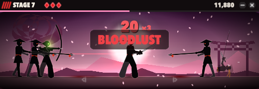
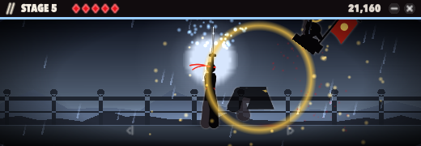
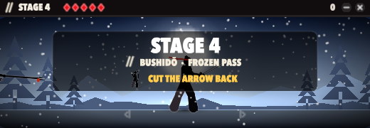

# Ronin

A pocket sword-fight for the Mac. One lone swordsman stands in the middle of a thin strip that floats over your
work. Enemies charge from both sides. The left mouse button cuts left and the right button cuts right. A stage
takes about half a minute, which fits in the gap between two tasks. Move the pointer away and the fight freezes
where it is.





## Play

- **Cut:** the **left mouse button** cuts left and the **right button** cuts right, wherever the pointer is on the
  lane. On a trackpad, a two-finger click or a control-click cuts right. Once the panel has the keys you can also
  use **←/→**, **A/D** or **F/J**. A cut hits the nearest enemy (or incoming arrow) on that side if it is within
  reach. The chevrons on the ground mark the reach, and they light up when a cut would land. Until you have cut
  down an enemy on each side, a mouse under each half of the lane shows which button to press.
- **Don't whiff:** a cut with nothing in reach makes him stumble. For a third of a second he can't cut, and your
  combo is gone.
- **Enemies:** *Ashigaru* spearmen (one cut). *Runners* (fast). *Brutes* (three cuts, each one knocks him back,
  and his blow costs two hearts). *Archers* stop out of reach and shoot: cut the arrow once it is in reach and it
  flies back into them. *Blade dancers* take two cuts, and the first one sends them flipping over your head to
  your other side. When an enemy raises his weapon he flushes red and a red marker appears over his head. The ring
  around the marker runs out as his blow comes. An archer drawing his bow shows a red sight line to you.
- **Warlord:** every fifth stage ends with one. He takes many cuts, and after each one he is either knocked back
  or leaps over you. His blow costs two hearts.
- **Combo:** every kill and every deflected arrow adds one. The combo multiplies your score (×2 at 10, up to ×8).
  At **20** you go into **bloodlust**: the screen turns red and your reach gets longer. A wound or a whiff ends the combo.
- **Difficulty** (menu ▸ Difficulty): each mode keeps its own stage.

  | Mode | Means | Hearts | Enemies | Your reach | Score |
  |---|---|---|---|---|---|
  | **Shoshin** (beginner's mind) | easy | 7 | slower, fewer, longer wind-ups | +8% | ×0.5 |
  | **Bushidō** (the way of the sword) | normal | 5 | as designed | — | ×1 |
  | **Shura** (the realm of carnage) | hard | 4 | faster, more, quicker blows | −3% | ×1.6 |
  | **Oni** (the demon) | insane | 3 | much faster, crowded, blows come fast | −8% | ×3 |

- **Stages:** you get a full set of hearts at the start of each stage. Clear the whole roster to move on. If you fall, you retry the same
  stage with a new roll. Each stage brings more enemies, faster ones, and new kinds, across eight settings: Crimson
  Dusk, Bamboo Grove, Blood Moon, Frozen Pass, Storm Bridge, Burning Village, Sakura Temple and Ash Fields.
- **Rank:** kills count toward your rank whether you win or lose. The ranks run from Wanderer through Swordsman,
  Ronin, Duelist, Blademaster, Kensei, Sword Saint and Demon Blade up to Legend.

## Stays out of the way

| | |
|---|---|
| Pause | Starts the moment the pointer leaves the panel. When the pointer comes back it has to rest for a third of a second (a ring fills) before the fight resumes, so crossing the panel on the way to something else costs nothing. Click to skip the wait. That click never cuts. SpriteKit stops drawing while paused, so a paused game uses no CPU. |
| Focus | Clicking the panel never activates Ronin. The app you were working in stays the active app. |
| Size | A strip 340, 420 or 520 pt wide and under 180 pt tall (menu ▸ Size). Press **C** or the header's – button to fold it into a 196×28 pill that shows the mode, the stage, your hearts and how many enemies are left. Click the pill to unfold it. |
| At a glance | The panel is small, so it uses pictures more than words. The header shows the mode (one to four blade strokes), the stage, your hearts, the score, and a bar for how much of the roster is down. The end card shows a skull for kills, crossed swords for your best combo and a clock for time, plus ▶ to go on or ↻ to try again. The pause screen is a pause sign. What text remains is heavy type on a dark plate. |
| Presence | No Dock icon. It has a menu bar icon. **⌃⌥R** shows and hides the panel from anywhere. It floats on every Space and over full-screen apps. It dims to 60% while the pointer is elsewhere. |
| Sound | None. |
| Save | Continuous (`~/Library/Application Support/Ronin/save.json`). If you quit mid-fight, you resume on the same frame. |

## Build

```sh
make test    # the core: cuts, reach, whiffs, every enemy, arrows, stages, career, saves (Linux too)
make sim     # the autopilot plays every stage: win rate, fight length, wounds
make run     # builds build/Ronin.app (macOS 14+) and opens it
```

- `RoninCore` is the game. It runs a fixed 120 Hz step, is seeded, and uses Foundation only. The same stage and
  seed always make the same fight, and a saved fight resumes exactly.
- `Ronin` is the app. It uses AppKit (the panel, the menu bar, a Carbon hot key) and SpriteKit (the lane). All art
  is drawn in code, with no asset files. Each silhouette is posed from a small skeleton and drawn into textures
  with tapered limbs. Each enemy kind has its own outline so you can tell them apart at 60 pt: a conical hat and
  spear, a shinobi hood, oni horns and a club, a scarf and twin blades, a bow taller than the archer, a crested
  helmet with a war banner. A faint rim of light keeps the black figures readable against dark ground. Walks
  have six frames, idles breathe, wind-ups have two stages, and each of the ronin's three cuts has a motion-blur
  frame and a follow-through. The effects include slash crescents, enemies cut in half, ink sprays, hit-stop,
  slow motion, screen shake and weather.
- `ronin-sim` plays stages in every mode (`--mode all`) with a human-like pilot (0.22 s reaction, 7 cuts a second,
  an occasional wrong-way cut) and with a perfect one. CI fails in any of these cases:
  - a mode's early stages stop being winnable by the human-like pilot (Shoshin through stage 10, Oni its first two),
  - the perfect pilot ever loses,
  - fights last less than 15 or more than 150 seconds.

CI (`.github/workflows/ci.yml`) runs the tests and the balance check on Linux and macOS, bundles the app, and
launches it with `RONIN_SELFTEST=1`. The self-test does these things in order:

1. Makes the first cut and a whiff with real left- and right-button events.
2. Lets the autopilot clear stage 1, then advances from the banner.
3. Shows the card for a newly introduced enemy.
4. Fights a warlord.
5. Switches to Oni and rides a combo into bloodlust.
6. Falls and rises again.
7. Switches back and checks that Bushidō kept its stage.
8. Folds into the pill and back.
9. Checks that leaving pauses and that coming back takes the dwell.
10. Checks the save.

It writes the screenshots above. CI then commits `dist/Ronin.app.zip`, `dist/Ronin.dmg` and the screenshots.

The app is ad-hoc signed and not notarised. The first time you open it, right-click ▸ Open, or run
`xattr -dr com.apple.quarantine Ronin.app`.
