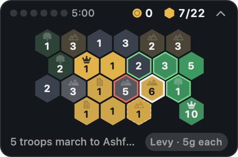

# Warlord

A conquest game for the Mac that lives in a small floating panel in a corner of your screen. You play it in
the gaps: finish a task, spend your orders on a few battles, get back to work. While you work, orders come back
and gold comes in. The realm doesn't move until you do.



## How it plays

- **The map.** A realm of 22–36 hex territories: plains, forest, hills, mountains and cities, some unclaimed and
  some held by up to three rival houses (the Crimson Host, the Azure Throne, the Verdant Oath, the Ashen Order).
  You start from a walled seat on the western edge.
- **Orders.** Each attack costs one order. You hold at most **6**, and one comes back every **5 minutes**, so a full
  stock is one short break of play. Once they're spent, the panel tells you when the next one arrives and reminds
  you to get back to work.
- **Attacking.** Click one of your lands, then a bordering one. Every soldier but one marches. You can also click
  the target first: your strongest army on that border is picked, and a second click attacks. While a land is
  selected, its targets are outlined by your odds: green is near-certain, amber is a gamble, red is folly.
  Hovering shows the exact numbers, e.g. `Attack Grimholt: 9 vs 5 ×1.35 — 72%`. Terrain and walls multiply the
  defenders.
- **Gold and levies.** Every land you hold pays gold each minute (cities and seats pay most). Gold keeps coming for
  up to 8 hours while you're away. **Levy** (the button, or right-click a land) raises 5 troops for 25 gold.
  Marching troops between your own lands is free.
- **Rivals.** Rival houses move only after you attack. They muster troops and grab unclaimed land, and now and then
  they raid a thinly held land of yours. They never march on your seat, so you can't be wiped out.
- **Breaking a house.** Take a rival's seat and the house breaks: all of its lands come over to you.
- **Rank.** Conquering a realm makes you Captain, then Warlord, Baron, Count, Duke, Prince, King, High King and
  Emperor. Each rank adds 10% to your income, and each new realm is larger and better defended. With a break every
  half hour, a realm takes about 2–3 hours of your day (`make sim` plays campaigns to check this).

## Built to stay out of the way

| | |
|---|---|
| **Never steals focus** | A non-activating panel that can't become key. Clicking it doesn't bring the app forward, so your editor keeps the keyboard. |
| **Small** | About 240 × 180 points, or fold it to a 26-point strip (chevron or double-click the header). Three sizes. |
| **Quiet** | No sounds, notifications, Dock icon or badges. A shield in the menu bar shows how many orders are ready. |
| **Out of sight** | Dims to 40% a moment after the pointer leaves, and floats over every Space and full-screen app. **⌃⌥W** shows or hides it from anywhere (no accessibility permission needed). |
| **Low stakes** | Your seat can't fall, nothing happens while you're away, and every order is saved the moment you give it. |

Drag the panel by its header. The menu-bar menu has Compact, Dim When Idle, Size, Open at Login, your record and
Abandon This Realm.

## Install and build

CI builds the app on every push and commits it to [`dist/`](dist/) as `Warlord.app.zip`, with a checksum. Unzip it
and drag Warlord to Applications. The app is ad-hoc signed, so on first launch right-click ▸ Open, or run
`xattr -dr com.apple.quarantine /Applications/Warlord.app`. Requires macOS 14.

```sh
make app     # builds build/Warlord.app (macOS, Xcode 15 or later)
make run     # builds and opens it
make test    # core tests (also run on Linux)
make sim     # plays campaigns with the advisor and prints how long each realm lasts
```

The campaign is saved to `~/Library/Application Support/Warlord/campaign.json`. Set `WARLORD_HOME` to keep it
somewhere else.

## Layout

| Path | Purpose |
|------|---------|
| `Sources/WarlordCore` | The game, Foundation only: hex geometry, realm generation, combat and odds, the rival houses, the clock for orders and gold, the advisor, saving. Builds and is tested on Linux. |
| `Sources/Warlord` | The app: the floating panel, the hand-drawn board (AppKit, so hover and clicks work in a panel that never becomes key), the menu-bar item, the ⌃⌥W hotkey, and a self-test. |
| `Sources/WarlordSim` | `warlord-sim`: plays whole campaigns to check the pacing. |
| `Tests/WarlordCoreTests` | Core tests. |
| `Packaging/`, `scripts/` | Bundle assembly (`LSUIElement`, so no Dock icon), icon rendering, ad-hoc signing. |
| `../.github/workflows/warlord.yml` | macOS: tests, bundle, and a launch self-test of the packaged app that plays orders through the panel's own click handling and saves `dist/preview.png`. Linux: core tests and a pacing run. |

MIT licensed.
